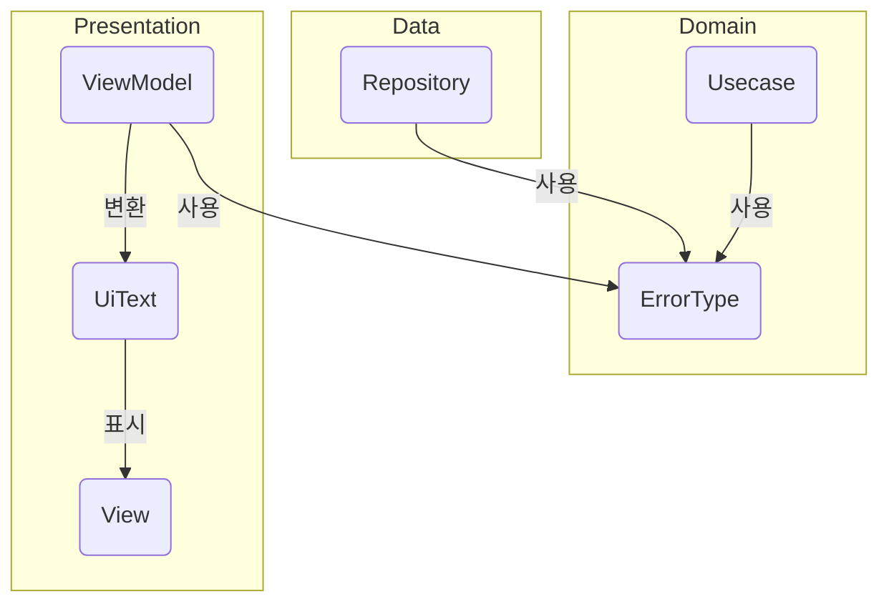
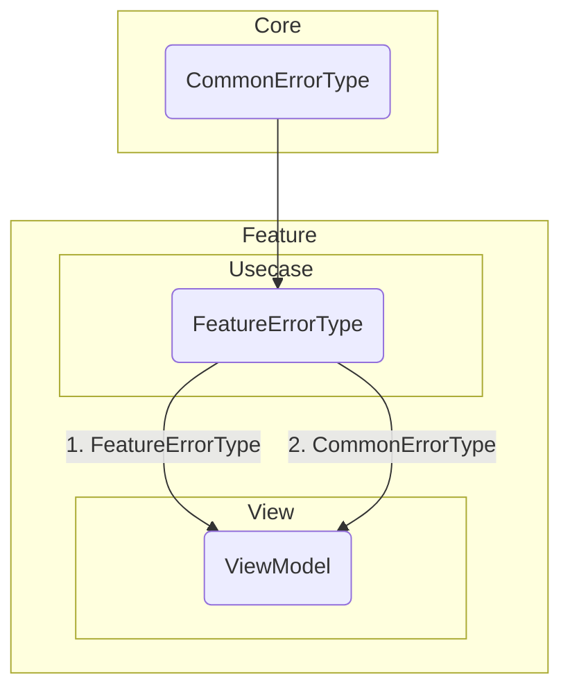

# 에러 처리 전략

- 에러는 보통 래퍼 클래스에서 제공되며, 이 프로젝트에서 래퍼 클래스는 세 가지 종류이다.
  1. `Result`: 기본 결과 래퍼 클래스
  2. `NetworkResult`: 네트워크 결과 래퍼 클래스
  3. `ValidationResult`: 유효성 검사 결과 래퍼 클래스
- **Domain** 계층에서 에러 타입을 선언한다.
- **Presentation** 계층에서 에러 타입에 매핑되는 텍스트 혹은 문자열 리소스를 등록한다.
- **Core** 모듈에서는 `CommonErrorType`을 기본적으로 사용하고,
    **Feature** 모듈(혹은 Feature 패키지)에서는 `(기능 명)ErrorType`을 사용한다.
- 각 파일에 대한 자세한 설명은 KDoc 주석에서 확인할 수 있다.

# 에러 사용 및 표시 시나리오


# 에러 매핑 시나리오

1번 처럼 자체 에러 타입을 직접 발생시키거나
2번 처럼 공통 에러 타입(혹은 의존성을 가지고 있는 다른 에러타입)을 그대로 전파한다.
```kotlin
sealed interface FeatureErrorType : BaseError {
    data object NotFound : FeatureErrorType

    data object Unexpected : FeatureErrorType

    data class CommonError(val error: CommonErrorType) : FeatureErrorType
}

class FeatureUseCase(
    private val commonRepository: CommonRepository,
) {
    operator fun invoke(): Result<Unit, FeatureErrorType> =
        commonRepository.mapError { commonError ->
            // CommonRepository 에서는 CommonErrorType 반환한다고 가정

            // 1) 자체 에러 발생
            FeatrueErrorType.Unexpected

            // 2) CommonErrorType 그대로 반환
            FeatureErrorType.CommonError(commonError)

            // 3) 조건부 반환
            when (commonError) {
                is CommonErrorType.IdNotFound -> FeatureErrorType.NotFound
                is CommonErrorType.Unexpected -> FeatureErrorType.Unexpected
                else -> FeatureErrorType.CommonError(commonError)
            }
        }
}
```


