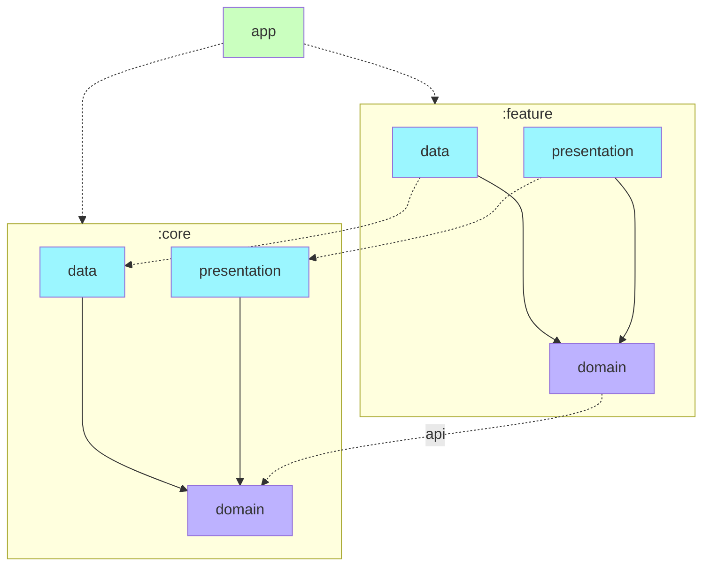

<h1 align="center">Turnin (턴인)</h1>

> 나를 위한 키워드 중심의 SNS

## Description

'나'에게 집중하고 '나'를 구성하고 있는 키워드들을 작성해보세요.

'나'와 유사한 키워드를 가진 또 다른 사람을 만나볼 수 있어요.

이제 타인으로 향한 시선 대신 '나'의 시선으로 전환해봐요.

## Demo

## Main Feature
### 계정
- 소셜로그인 / 회원가입
- 로그아웃 / 탈퇴
- 계정 정보 수정

### 메인 기능
- 키워드 등록, 조회, 수정, 삭제
- 홈 피드 조회
- 사용자 키워드 탐색 (유사 키워드 탐색)

### 신고/차단
- 프로필 신고, 차단
- 키워드 신고

### 친구 시스템
- 친구 목록 조회
- 친구 요청과 거절 및 요청 취소

### 부가 기능
- 차단 사용자 목록 조회
- 푸시 알림
- 알림 목록 조회

## Tech Stack
- Minimum SDK 17
- **Language & Core**: Kotlin, Kotlin Coroutines & Flow
- **Library & Framework**: Jetpack Compose, Hilt, Retrofit, Room, DataStore, Moshi, Timber, Coil, Firebase, JUnit4, MockK
- **Architecture**: Clean Architecture (+ MVVM / MVI)
- **Lint**: Ktlint

## Architecture & Modularization

