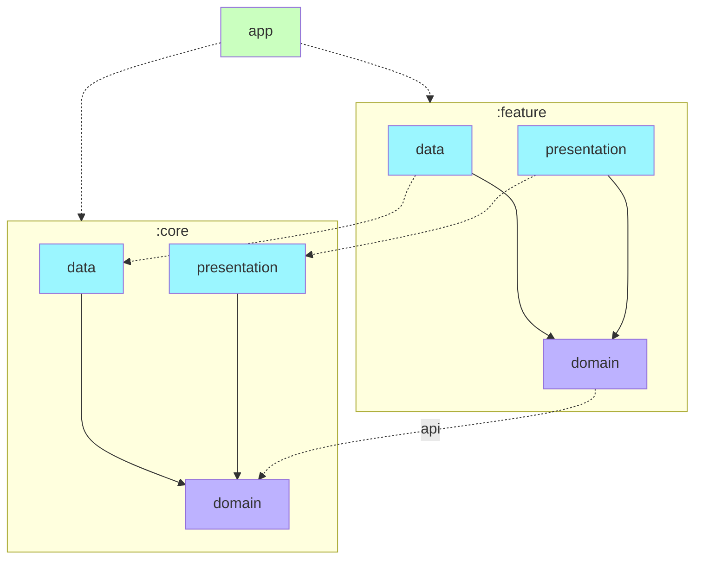

# peekr-android

# Documents

| No | Title                                                |
|:--:|:-----------------------------------------------------|
| 1  | [Project Structure](#1-project-structure-processing) |
| 2  | [Dependency Direction](#2-dependency-direction)      |

## 1. Project Structure (processing...)

```
app/                         # <APP 모듈>
├── navigation/              # 모든 네비게이션 라우터들이 위치
├── ...                      # 기타 파일 (MainActivity.kt 등)

core/                         # <Core 모듈>
├── common                      # <Core/Common 모듈>
├── data/                       # <Core/Data 모듈>
├── designsystem/               # <Core/DesignSystem 모듈>
├── domain/                     # <Core/Domain 모듈>
├── presentation/               # <Core/Presentation 모듈>

data/                        # <Data 모듈>
├── shared                      # 공통 기능 (선택사항)
├── feature 1                   # 기능 1
├── feature 2                   # 기능 2
├── ...

domain/                      # <Domain 모듈>
├── shared                      # 공통 기능 (선택사항)
├── feature 1                   # 기능 1
├── feature 2                   # 기능 2
├── ...

presentation/                # <Presentation(feature) 모듈>
├── shared                      # 공통 기능 (선택사항)
├── feature 1                   # 기능 1
├── feature 2                   # 기능 2
├── ...
```

1. core 모듈을 제외한 모듈은 계층 별 모듈 구조 형태이며, 각 모듈 내부에서는 기능 별로 패키지가 구분되어 있다.
2. 기본적으로 클린아키텍처를 따른다.
3. 각 기능은 core 모듈을 의존한다. (계층 별로 의존 가능)
4. `data`, `domain`, `presentation` 의존성 방향은 항상 아래와 같다.
   (`data` -> `domain` <- `presentation`)

## 2. Dependency Direction



(`:core:common`과 `:core:designsystem`는 필요에 맞게 사용)
