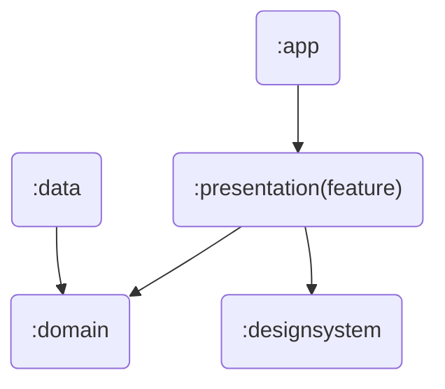
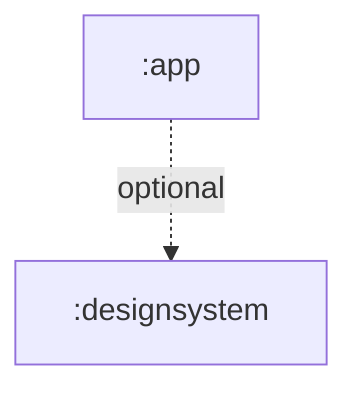

# peekr-android

# Documents

| No  | Title                                                 |
|:---:|:------------------------------------------------------|
|  1  | [Project Structure](#1-project-structure-processing)  |
|  2  | [Dependency Direction](#2-dependency-direction)       |


## 1. Project Structure (processing...)
```
app/                         # <APP 모듈>
├── navigation/              # 모든 네비게이션 라우터들이 위치
├── ...                      # 기타 파일 (MainActivity.kt 등)

data/                        # <Data 모듈> 
├── local/                   # 로컬 데이터
├── network/                 # 네트워크(리모트) 데이터
├── repository/              # 리포지토리 (구현체)
├── di/                      # 의존성 관리
└── util/                    # 유틸

designsystem/                # <DesignSystem 모듈>
├── component/               # 공통 컴포넌트
├── theme/                   # Peekr 테마
└── util/                    # 유틸

domain/                      # <Domain 모듈> 
├── model/                   # 비즈니스 모델
├── repository/              # 리포지토리 (인터페이스)
├── usecase/                 # 유스케이스
└── util/                    # 유틸

presentation/                # <Presentation(feature) 모듈>
├── feature 1                # 기능 1
│   ├── navigation/          # 네비게이션
│   ├── state/               # 상태
│   ├── view/                # 뷰
│   ├── viewmodel/           # 뷰모델
│   └── util/                # 유틸
│
├── feature 2                
│   ├── ...
├── ...
```
## 2. Dependency Direction

