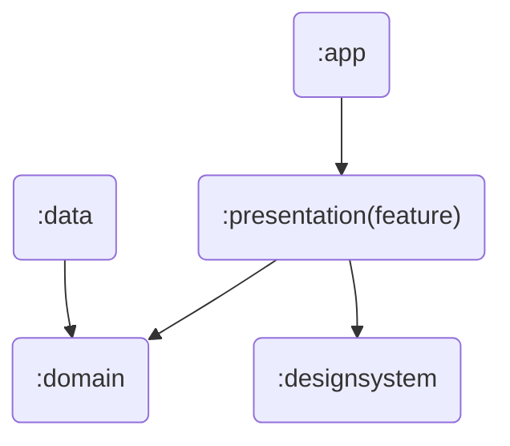
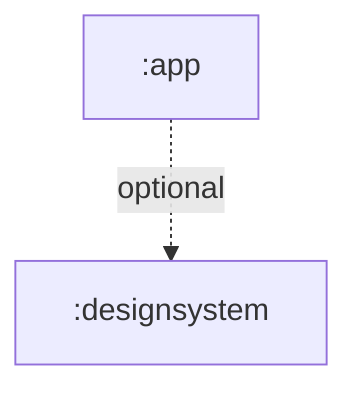

# peekr-android

# Documents

| No | Title                                                |
|:--:|:-----------------------------------------------------|
| 1  | [Project Structure](#1-project-structure-processing) |
| 2  | [Dependency Direction](#2-dependency-direction)      |

## 1. Project Structure (processing...)

```
app/                         # <APP 모듈>
├── navigation/              # 모든 네비게이션 라우터들이 위치
├── ...                      # 기타 파일 (MainActivity.kt 등)

data/                        # <Data 모듈>
├── shared                   # 공통 기능 (선택사항)
├── feature 1                # 기능 1
│   ├── local/               # 로컬 데이터
│   ├── network/             # 네트워크(리모트) 데이터
│   ├── repository/          # 리포지토리 (구현체)
│   ├── di/                  # 의존성 관리
│   └── util/                # 유틸
│
├── feature 2
│   ├── ...
├── ...

designsystem/                # <DesignSystem 모듈>
├── component/               # 공통 컴포넌트
├── theme/                   # Peekr 테마
└── util/                    # 유틸

domain/                      # <Domain 모듈>
├── shared                   # 공통 기능 (선택사항)
├── feature 1                # 기능 1
│   ├── model/               # 비즈니스 모델
│   ├── repository/          # 리포지토리 (인터페이스)
│   ├── usecase/             # 유스케이스
│   └── util/                # 유틸
│
├── feature 2
│   ├── ...
├── ...

presentation/                # <Presentation(feature) 모듈>
├── shared                   # 공통 기능 (선택사항)
├── feature 1                # 기능 1
│   ├── navigation/          # 네비게이션
│   ├── state/               # 상태
│   ├── view/                # 뷰
│   ├── viewmodel/           # 뷰모델
│   └── util/                # 유틸
│
├── feature 2
│   ├── ...
├── ...
```

1. 계층 별 모듈 구조 형태이며, 각 모듈 내부에서는 기능 별 구조 형태이다.
2. 기본적으로 꼭 필요한 상황을 제외하고는 기능 간 의존은 지양한다.
    - 추후 앱이 커질 경우에 기능 별 모듈 구조로 마이그레이션 할 예정이기 때문이다.
    - 기능 간 결합성을 줄이고 각 기능의 응집력을 높이기 위해서이다.
3. 올바른 예시
    - `:data/a/ -> :domain/a/`
    - `:presentation/a/ -> :domain/a/`
4. 올바르지 않은 예시
    - `:data/a/ -> :domain/b/`
    - `:presentation/a/ -> :domain/c/`
    - `:domain/a/ -> domain/c/`
    - `:domain/account/ -> :domain/user/` **(애초에 account가 user을 의존해야 하는 상황이면 이 상황은 예외이다.)**

## 2. Dependency Direction




