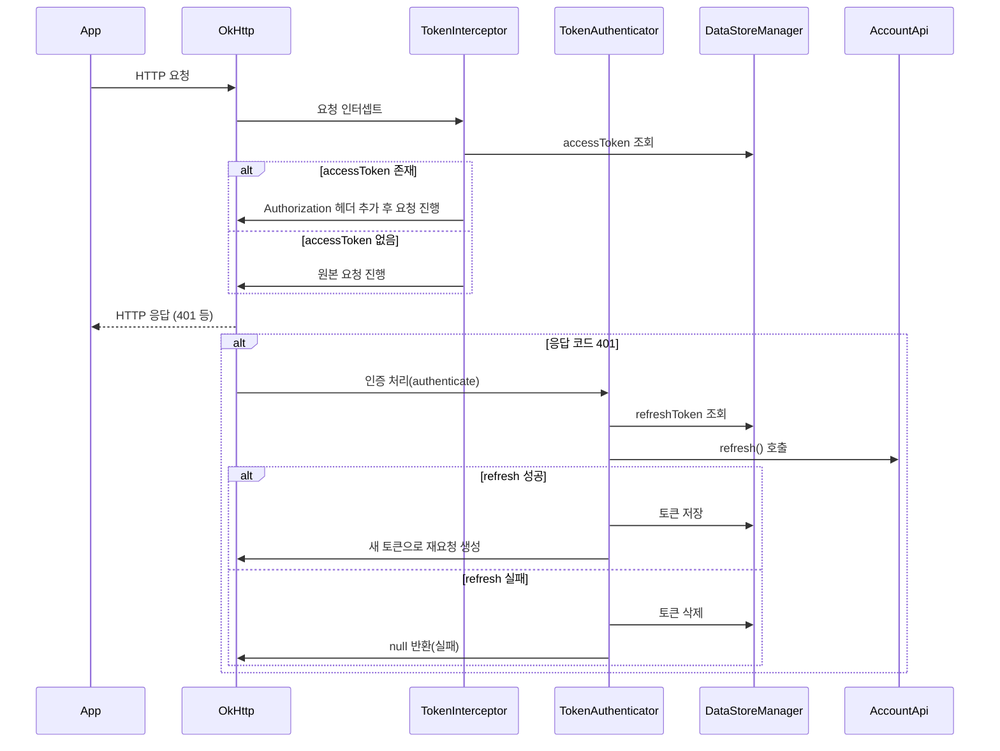

### TokenAuthenticator, TokenInterceptor Flow

```mermaid
sequenceDiagram
    participant App
    participant OkHttp
    participant TokenInterceptor
    participant TokenAuthenticator
    participant DataStoreManager
    participant AccountApi
    App ->> OkHttp: HTTP 요청
    OkHttp ->> TokenInterceptor: 요청 인터셉트
    TokenInterceptor ->> DataStoreManager: accessToken 조회
    alt accessToken 존재
        TokenInterceptor ->> OkHttp: Authorization 헤더 추가 후 요청 진행
    else accessToken 없음
        TokenInterceptor ->> OkHttp: 원본 요청 진행
    end
    OkHttp -->> App: HTTP 응답 (401 등)
    alt 응답 코드 401
        OkHttp ->> TokenAuthenticator: 인증 처리(authenticate)
        TokenAuthenticator ->> DataStoreManager: refreshToken 조회
        TokenAuthenticator ->> AccountApi: refresh() 호출
        alt refresh 성공
            TokenAuthenticator ->> DataStoreManager: 토큰 저장
            TokenAuthenticator ->> OkHttp: 새 토큰으로 재요청 생성
        else refresh 실패
            TokenAuthenticator ->> DataStoreManager: 토큰 삭제
            TokenAuthenticator ->> OkHttp: null 반환(실패)
        end
    end

```
