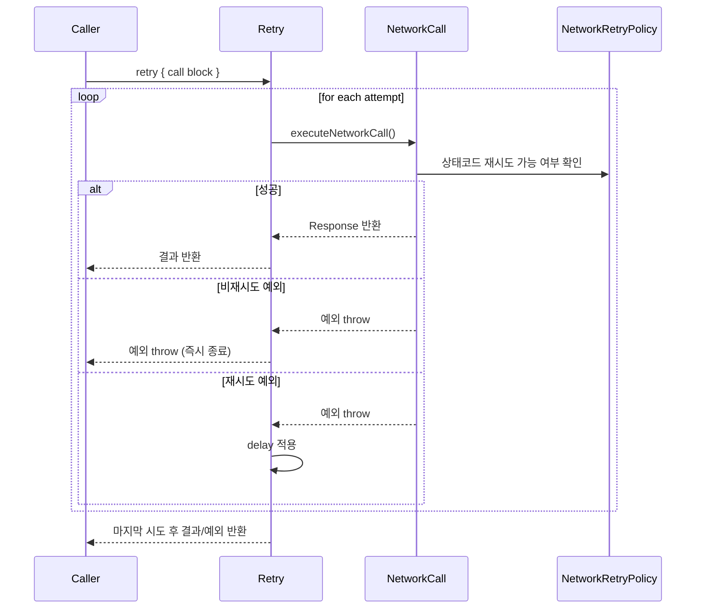

```mermaid
sequenceDiagram
    participant Caller
    participant Retry
    participant NetworkCall
    participant NetworkRetryPolicy
    Caller ->> Retry: retry { call block }
    loop for each attempt
        Retry ->> NetworkCall: executeNetworkCall()
        NetworkCall ->> NetworkRetryPolicy: 상태코드 재시도 가능 여부 확인
        alt 성공
            NetworkCall -->> Retry: Response 반환
            Retry -->> Caller: 결과 반환
        else 비재시도 예외
            NetworkCall -->> Retry: 예외 throw
            Retry -->> Caller: 예외 throw (즉시 종료)
        else 재시도 예외
            NetworkCall -->> Retry: 예외 throw
            Retry ->> Retry: delay 적용
        end
    end
    Retry -->> Caller: 마지막 시도 후 결과/예외 반환
```
