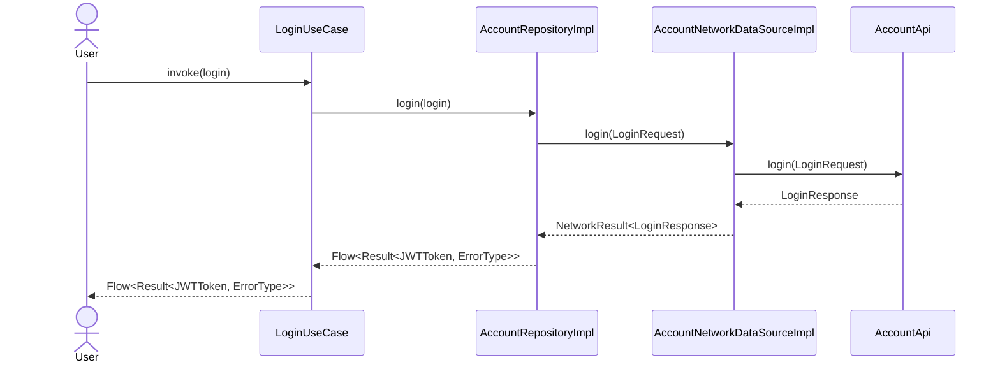

### Login Flow

```mermaid
sequenceDiagram
    actor User
    participant UseCase as LoginUseCase
    participant Repo as AccountRepositoryImpl
    participant NetworkDS as AccountNetworkDataSourceImpl
    participant API as AccountApi
    User ->> UseCase: invoke(login)
    UseCase ->> Repo: login(login)
    Repo ->> NetworkDS: login(LoginRequest)
    NetworkDS ->> API: login(LoginRequest)
    API -->> NetworkDS: LoginResponse
    NetworkDS -->> Repo: NetworkResult<LoginResponse>
    Repo -->> UseCase: Flow<Result<JWTToken, ErrorType>>
    UseCase -->> User: Flow<Result<JWTToken, ErrorType>>

```
