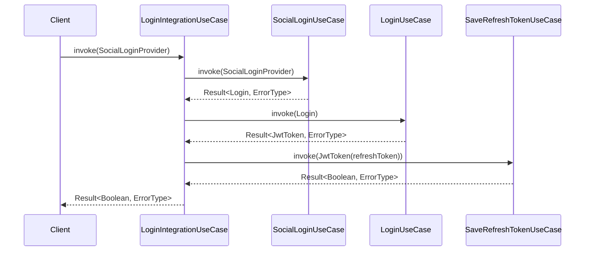

### LoginIntegrationUseCase(로그인 통합 유스케이스) Flow

```mermaid
sequenceDiagram
    participant CL as Client
    participant UseCase as LoginIntegrationUseCase
    participant Social as SocialLoginUseCase
    participant Login as LoginUseCase
    participant Token as SaveRefreshTokenUseCase
    CL ->> UseCase: invoke(SocialLoginProvider)
    UseCase ->> Social: invoke(SocialLoginProvider)
    Social -->> UseCase: Result<Login, ErrorType>
    UseCase ->> Login: invoke(Login)
    Login -->> UseCase: Result<JwtToken, ErrorType>
    UseCase ->> Token: invoke(JwtToken(refreshToken))
    Token -->> UseCase: Result<Boolean, ErrorType>
    UseCase -->> CL: Result<Boolean, ErrorType>

```
