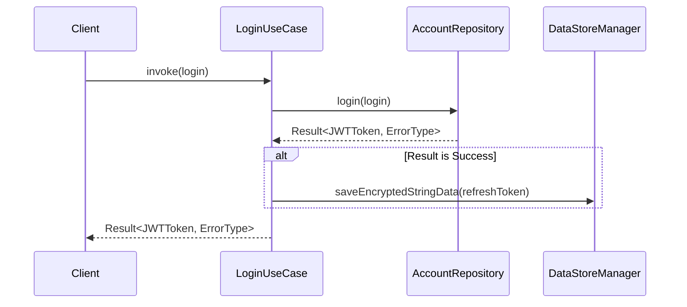

### LoginUseCase Flow

```mermaid
sequenceDiagram
    participant Client
    participant LoginUseCase
    participant AccountRepository
    participant DataStoreManager
    Client ->> LoginUseCase: invoke(login)
    LoginUseCase ->> AccountRepository: login(login)
    AccountRepository -->> LoginUseCase: Result<JWTToken, ErrorType>
    alt Result is Success
        LoginUseCase ->> DataStoreManager: saveEncryptedStringData(refreshToken)
    end
    LoginUseCase -->> Client: Result<JWTToken, ErrorType>

```
