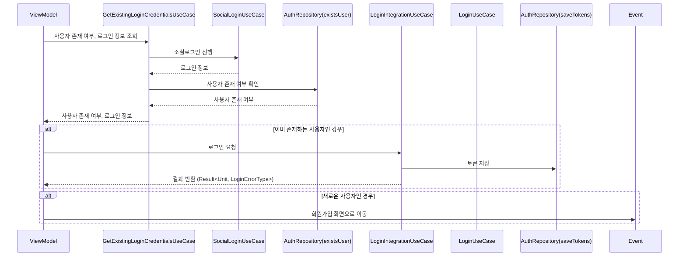

### 로그인 흐름

```mermaid
sequenceDiagram
    participant VM as ViewModel
    participant GetLogin as GetExistingLoginCredentialsUseCase
    participant Social as SocialLoginUseCase
    participant Exists as AuthRepository(existsUser)
    participant UseCase as LoginIntegrationUseCase
    participant Login as LoginUseCase
    participant Token as AuthRepository(saveTokens)
    VM ->> GetLogin: 사용자 존재 여부, 로그인 정보 조회
    GetLogin ->> Social: 소셜로그인 진행
    Social -->> GetLogin: 로그인 정보
    GetLogin ->> Exists: 사용자 존재 여부 확인
    Exists -->> GetLogin: 사용자 존재 여부
    GetLogin -->> VM: 사용자 존재 여부, 로그인 정보
    alt 이미 존재하는 사용자인 경우
        VM ->> UseCase: 로그인 요청
        UseCase ->> Token: 토큰 저장
        UseCase -->> VM: 결과 반환 (Result<Unit, LoginErrorType>)
    end
    alt 새로운 사용자인 경우
        VM ->> Event: 회원가입 화면으로 이동
    end

```
