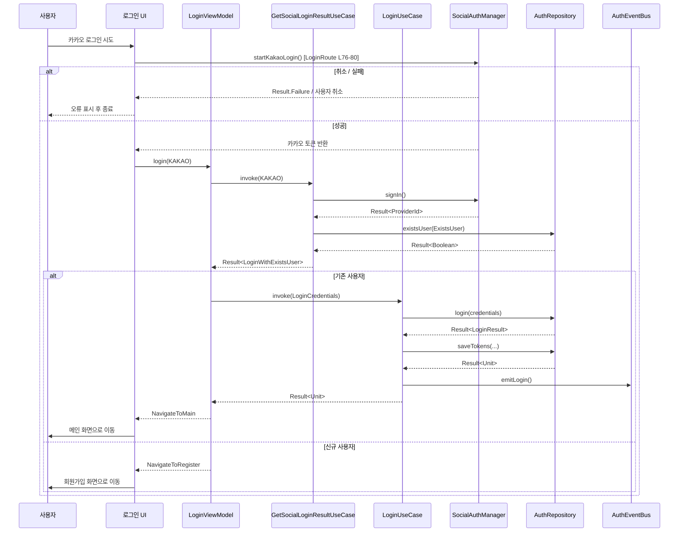

# 로그인 흐름 (카카오 로그인 기준)

```mermaid
sequenceDiagram
    participant User as 사용자
    participant LoginUI as 로그인 UI
    participant LoginVM as LoginViewModel
    participant GetSocialLogin as GetSocialLoginResultUseCase
    participant LoginUseCase as LoginUseCase
    participant AuthMgr as SocialAuthManager
    participant AuthRepo as AuthRepository
    participant EventBus as AuthEventBus

    User->>LoginUI: 카카오 로그인 시도
    LoginUI->>AuthMgr: startKakaoLogin() [LoginRoute L76-80]

    alt 취소 / 실패
        AuthMgr-->>LoginUI: Result.Failure / 사용자 취소
        LoginUI-->>User: 오류 표시 후 종료
    else 성공
        AuthMgr-->>LoginUI: 카카오 토큰 반환
        LoginUI->>LoginVM: login(KAKAO)
        LoginVM->>GetSocialLogin: invoke(KAKAO)
        GetSocialLogin->>AuthMgr: signIn()
        AuthMgr-->>GetSocialLogin: Result<ProviderId>
        GetSocialLogin->>AuthRepo: existsUser(ExistsUser)
        AuthRepo-->>GetSocialLogin: Result<Boolean>
        GetSocialLogin-->>LoginVM: Result<LoginWithExistsUser>

        alt 기존 사용자
            LoginVM->>LoginUseCase: invoke(LoginCredentials)
            LoginUseCase->>AuthRepo: login(credentials)
            AuthRepo-->>LoginUseCase: Result<LoginResult>
            LoginUseCase->>AuthRepo: saveTokens(...)
            AuthRepo-->>LoginUseCase: Result<Unit>
            LoginUseCase->>EventBus: emitLogin()
            LoginUseCase-->>LoginVM: Result<Unit>
            LoginVM-->>LoginUI: NavigateToMain
            LoginUI->>User: 메인 화면으로 이동
        else 신규 사용자
            LoginVM-->>LoginUI: NavigateToRegister
            LoginUI->>User: 회원가입 화면으로 이동
        end
    end
```
