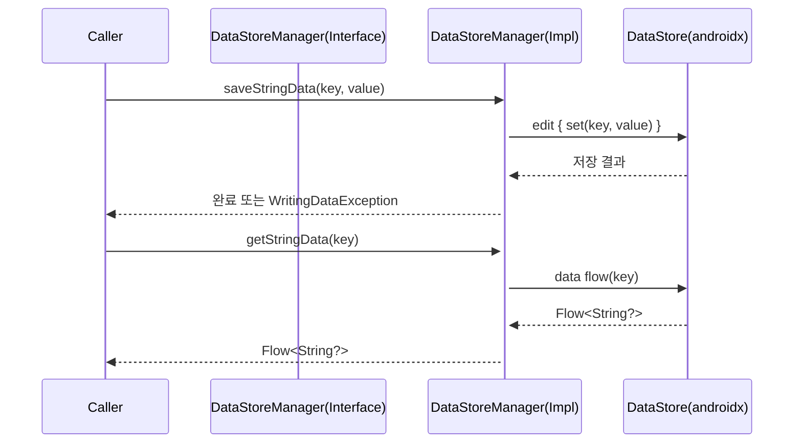
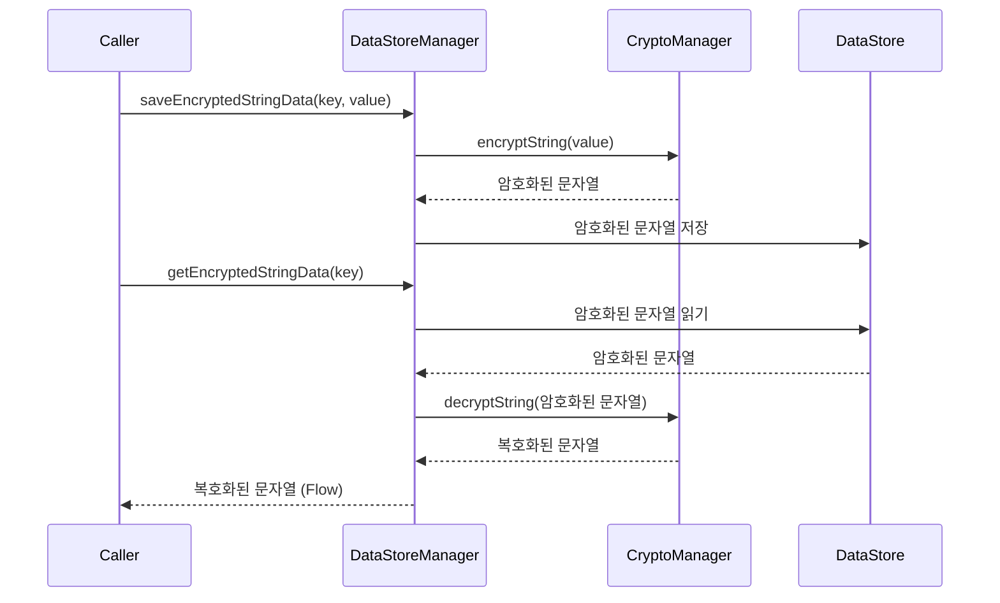

### DataStoreManager Flow

```mermaid
sequenceDiagram
    participant Caller
    participant DataStoreManager(Interface)
    participant DataStoreManager(Impl)
    Caller ->> DataStoreManager(Impl): saveStringData(key, value)
    activate DataStoreManager(Impl)
    DataStoreManager(Impl) ->> DataStore(androidx): edit { set(key, value) }
    DataStore(androidx) -->> DataStoreManager(Impl): 저장 결과
    DataStoreManager(Impl) -->> Caller: 완료 또는 WritingDataException
    Caller ->> DataStoreManager(Impl): getStringData(key)
    DataStoreManager(Impl) ->> DataStore(androidx): data flow(key)
    DataStore(androidx) -->> DataStoreManager(Impl): Flow<String?>
    DataStoreManager(Impl) -->> Caller: Flow<String?>

```

### DataStoreManager Encrypt Method Flow

```mermaid
sequenceDiagram
    participant Caller
    participant DataStoreManager
    participant CryptoManager
    participant DataStore
    Caller ->> DataStoreManager: saveEncryptedStringData(key, value)
    DataStoreManager ->> CryptoManager: encryptString(value)
    CryptoManager -->> DataStoreManager: 암호화된 문자열
    DataStoreManager ->> DataStore: 암호화된 문자열 저장
    Caller ->> DataStoreManager: getEncryptedStringData(key)
    DataStoreManager ->> DataStore: 암호화된 문자열 읽기
    DataStore -->> DataStoreManager: 암호화된 문자열
    DataStoreManager ->> CryptoManager: decryptString(암호화된 문자열)
    CryptoManager -->> DataStoreManager: 복호화된 문자열
    DataStoreManager -->> Caller: 복호화된 문자열 (Flow)

```
