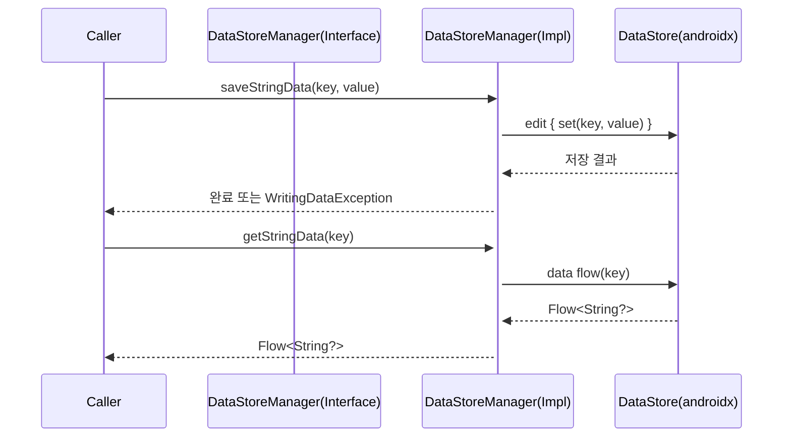

### DataStoreManager Flow

```mermaid
sequenceDiagram
    participant Caller
    participant DataStoreManager(Interface)
    participant DataStoreManager(Impl)
    Caller ->> DataStoreManager(Impl): saveStringData(key, value)
    activate DataStoreManager(Impl)
    DataStoreManager(Impl) ->> DataStore(androidx): edit { set(key, value) }
    DataStore(androidx) -->> DataStoreManager(Impl): 저장 결과
    DataStoreManager(Impl) -->> Caller: 완료 또는 WritingDataException
    Caller ->> DataStoreManager(Impl): getStringData(key)
    DataStoreManager(Impl) ->> DataStore(androidx): data flow(key)
    DataStore(androidx) -->> DataStoreManager(Impl): Flow<String?>
    DataStoreManager(Impl) -->> Caller: Flow<String?>

```
