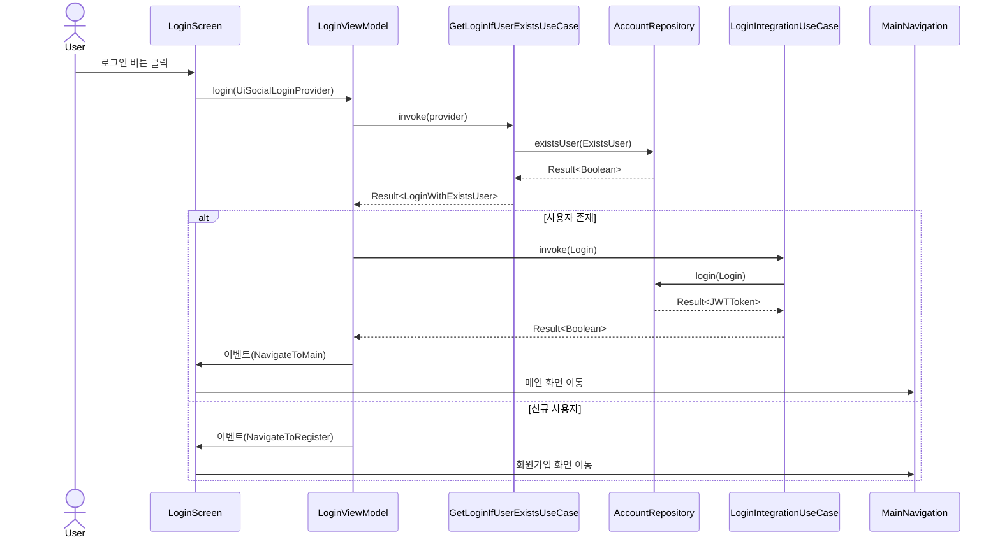

##### Login Flow

```mermaid
sequenceDiagram
    actor User
    participant LoginScreen
    participant LoginViewModel
    participant GetLoginIfUserExistsUseCase
    participant AccountRepository
    participant LoginIntegrationUseCase
    participant MainNavigation
    User ->> LoginScreen: 로그인 버튼 클릭
    LoginScreen ->> LoginViewModel: login(UiSocialLoginProvider)
    LoginViewModel ->> GetLoginIfUserExistsUseCase: invoke(provider)
    GetLoginIfUserExistsUseCase ->> AccountRepository: existsUser(ExistsUser)
    AccountRepository -->> GetLoginIfUserExistsUseCase: Result<Boolean>
    GetLoginIfUserExistsUseCase -->> LoginViewModel: Result<LoginWithExistsUser>
    alt 사용자 존재
        LoginViewModel ->> LoginIntegrationUseCase: invoke(Login)
        LoginIntegrationUseCase ->> AccountRepository: login(Login)
        AccountRepository -->> LoginIntegrationUseCase: Result<JWTToken>
        LoginIntegrationUseCase -->> LoginViewModel: Result<Boolean>
        LoginViewModel ->> LoginScreen: 이벤트(NavigateToMain)
        LoginScreen ->> MainNavigation: 메인 화면 이동
    else 신규 사용자
        LoginViewModel ->> LoginScreen: 이벤트(NavigateToRegister)
        LoginScreen ->> MainNavigation: 회원가입 화면 이동
    end

```
